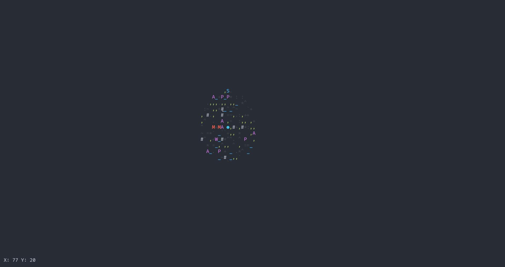
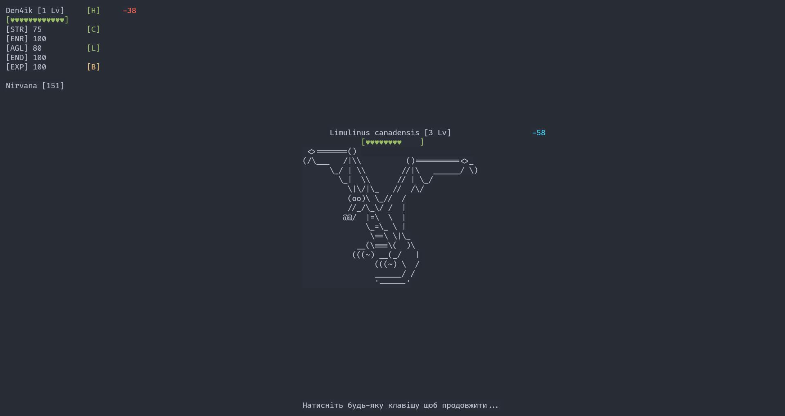

# CSharpCourse

In this repo you can found my homework from C# course

# ConsoleRPG

It's my best project in course. It's game in console, where you can move on map
and fight with monsters. Also you can explore world and pick up magic items.

